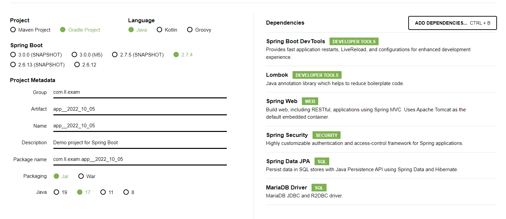

* 세팅

### <학습내용>
* #### 일반 로그인과 JWT 로그인은 큰 차이점이 있다.
    - ##### 일반 세션 (POST member/login)
      - 회원번호가 일치하는지 확인
      - 세션변수 생성 (Security 방식)
      
       
      
    - ##### JWT (POST member/login)
      - 회원 정보가 일치하는지 확인
      - JWT 형식의 accessToken을 발급
      - 세션자체가 없기 때문에 매번 memberContext를 넘겨줘야됨.

 

* 세션
    * http://localhost:8080/article/lsit
    * http://localhost:8080/article/1/modify
    * http://localhost:8080/article/1/delete
    * http://localhost:8080/article/1

 

* REST
    * GET http://localhost:8080/articles : 리스트조회
    * POST http://localhost:8080/articles : 작성
    * GET http://localhost:8080/articles/5 : 단건 조회
    * PUT http://localhost:8080/articles : 단건수정
    * DELETE http://localhost:8080/articles : 삭제

